<picture>
  <source media="(prefers-color-scheme: dark)" srcset="./assests/dark.svg">
  <source media="(prefers-color-scheme: light)" srcset="./assests/light.svg">
  
</picture>

<h1 align="center">Namaste 🙏🏽, I'm Sushant Kumar</h1>
<h3 align="center">Full-Stack & React Native Engineer · Industrial IoT · New Delhi, India</h3>

  <a href="https://sushantkr961.github.io/">Portfolio</a> ·
  <a href="https://www.linkedin.com/in/sushantkr961/">LinkedIn</a> ·
  <a href="https://github.com/sushantkr961">GitHub</a> ·
  <a href="https://drive.google.com/file/d/14Qq1p4eUGvDNjziaUtVvT7HynPCK1jtx/view?usp=sharing">Resume</a> ·
  <a href="mailto:sushantonly961@gmail.com">Email</a>

  

I build and ship web and mobile products across the JavaScript / TypeScript ecosystem — from the first commit to the App Store, Google Play, the factory floor and production, and then I keep them running. Today I lead platform engineering at **Uptime Linked**, an Industrial IoT company, and I take on freelance builds and full-time conversations.

## 💫 About / Focus

- 🏭 **Industrial IoT** — turning live machine-sensor data (power meters, cycle counters, Modbus devices) into dashboards, OEE and downtime insight.
- 📱 **Mobile** — cross-platform iOS + Android apps in React Native that actually reach the stores.
- 🌐 **Full-stack web** — Next.js, React and Node.js products, dashboards, CRMs and ERPs.
- 🧩 **Product ownership** — architecture to delivery, CI/CD on AWS, code-review standards, and mentoring the team around me.
- ⚗️ Mechanical engineer by degree, software engineer by choice.

## 💼 Experience

**Uptime Linked** (Hungrybulb Technologies Pvt Ltd.) — *Full-Stack Developer & Product Lead* · Mar 2026 – Present · New Delhi
- Lead product development across the company's Industrial IoT platforms, from architecture to delivery, with the engineering team.
- Build the cross-platform mobile and web apps (React Native, React, Node.js, TypeScript) that integrate real-time machine-sensor data for manufacturing operations.
- Set up CI/CD pipelines and code-review standards on AWS.

**Pantheon Digital Pvt Ltd.** — *Software Developer / Project Lead* · Apr 2023 – Feb 2026 · New Delhi
- Led full-stack development of LoadingWalla, ZFour HRMS and the company website; promoted to project lead within the first year and mentored the developer team.
- Shipped the LoadingWalla logistics suite: Android app on Google Play (real-time GPS tracking, fleet management, toll automation), a Next.js web platform and an admin CRM.
- Delivered ZFour HRMS end to end: web portal plus React Native apps on Google Play and the App Store, with role-based access, attendance tracking and real-time feeds.
- Engineered a high-frequency geolocation ingestion service in Node.js on a Redis Streams producer/consumer architecture.

**Freelance**
- **Indulge Global** (2024) — React Native frontend and API integration for a lifestyle-deals app, shipped to both stores.
- **Jas Oberoi Group** (2024) — Next.js + Node/Express/MongoDB website for a real-estate team in Surrey, BC. [jasoberoi.ca](https://jasoberoi.ca)

**Education** — B.Tech, Mechanical Engineering, Aryabhatta Knowledge University (LNJPIT), Patna · Full-Stack Web Development, Masai School, Bengaluru

**Recognition** — “Outstanding Team Leader” at Pantheon Digital · 2nd place, Masai School Hackathon

## 🚀 Featured Projects

| Project | What it is | Stack | Links |
| --- | --- | --- | --- |
| **UptimeLinked** | Manufacturing IoT platform: sensor readings over MQTT become live machine boards, shift production sheets, OEE, downtime tickets, energy reports and ANDON kiosks. | Next.js, TypeScript, Prisma, MySQL, TimescaleDB, MQTT, AWS | employer · private |
| **TaktBoard** | Production-planning and traceability MES: orders become batches that move through a visual workflow, with QR scanning, rework tracking and OEE analytics. | Next.js, React, Prisma, MySQL, React Flow, TanStack Query | employer · private |
| **LoadingWalla** | Logistics marketplace connecting shippers with truck operators: live GPS tracking, load matching, toll calculator, KYC, payments. | React Native, Redux-Saga, Firebase, Next.js, Laravel | [Google Play](https://play.google.com/store/apps/details?id=com.loadingwalla) · [Website](https://loadingwalla.com) |
| **ZFour HRMS** | HR suite on both app stores: geo-fenced attendance, leave, payroll, recruitment ATS, helpdesk and an internal social feed. | Laravel, MySQL, React Native, Redux-Saga, Firebase | employer · private |
| **School Management System** | Multi-branch school ERP that installs from a single desktop shortcut: an Electron supervisor boots MariaDB, an Express API and a Next.js server, with structural multi-tenant isolation via a Prisma extension. | TypeScript, Next.js, Electron, Express, Prisma, MariaDB | [Source](https://github.com/sushantkr961/School-Mangagement-Software---onPremise) |
| **SkMart** | MERN e-commerce store with PayPal checkout, an admin dashboard and real-time Socket.IO chat with the store admin. | React, Node.js, Express, MongoDB, Socket.IO, Redux | [Live](https://skmart.onrender.com) · [Source](https://github.com/sushantkr961/SkMart) |
| **Tripadvisor Clone** | Hotel browsing with debounced search, full account management and an admin dashboard. | TypeScript, React, Express, MongoDB, Chakra UI, Redux | [Source](https://github.com/sushantkr961/Tripadvisor-Clone) |
| **Workflo** | Kanban task board on the Next.js App Router with JWT sessions and Mongoose persistence. | TypeScript, Next.js, Redux Toolkit, MongoDB, Tailwind CSS | [Source](https://github.com/sushantkr961/workflo-) |
| **MERN Chat App** | One-to-one and group messaging with JWT auth and a Chakra UI frontend. | React, Node.js, Express, MongoDB | [Source](https://github.com/sushantkr961/chat_app) |

## 🛠️ Engineering Stack

| Area | Technologies |
| --- | --- |
| Languages | JavaScript, TypeScript, Python, PHP |
| Mobile | React Native, Expo, Redux-Saga, Firebase, Android Studio, Xcode |
| Web | React, Next.js, Redux, TanStack Query, Tailwind CSS, Recharts, Vite, PWA, i18next |
| Backend | Node.js, Express, REST APIs, Socket.IO, Prisma, Sequelize, Laravel |
| Data | MySQL, MongoDB, Redis, TimescaleDB, MariaDB |
| Cloud / DevOps | AWS, Docker, CI/CD, Linux, Git, GitHub, GitLab |
| IoT / Edge | MQTT, Modbus RTU / RS485, Raspberry Pi, ESP32 |
| Practice | System Design, Design Patterns, MVC, Agile, Data Structures & Algorithms, AI-assisted development |

## 📊 GitHub Activity

  
  <picture>
    <source media="(prefers-color-scheme: dark)" srcset="https://github-profile-summary-cards.vercel.app/api/cards/most-commit-language?username=sushantkr961&theme=github_dark">
    
  </picture>

## 🌐 Connect

- 💼 LinkedIn — [linkedin.com/in/sushantkr961](https://www.linkedin.com/in/sushantkr961/)
- 🐦 X (Twitter) — [@sushantkr961](https://twitter.com/sushantkr961)
- 🌍 Portfolio — [sushantkr961.github.io](https://sushantkr961.github.io/)
- 📄 Resume — [Google Drive](https://drive.google.com/file/d/14Qq1p4eUGvDNjziaUtVvT7HynPCK1jtx/view?usp=sharing)
- ✉️ Email — [sushantonly961@gmail.com](mailto:sushantonly961@gmail.com)

Open to freelance product builds and full-time Full-Stack / React Native / IoT lead roles — hybrid in New Delhi or remote.
